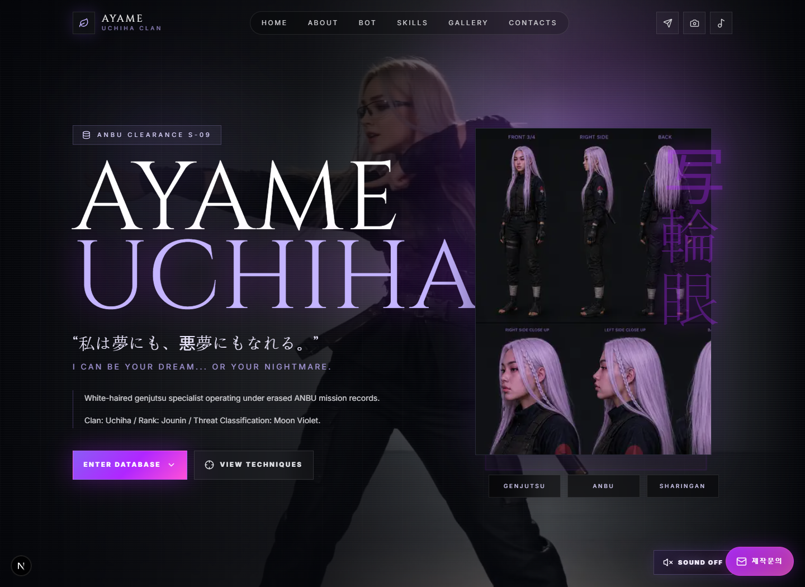
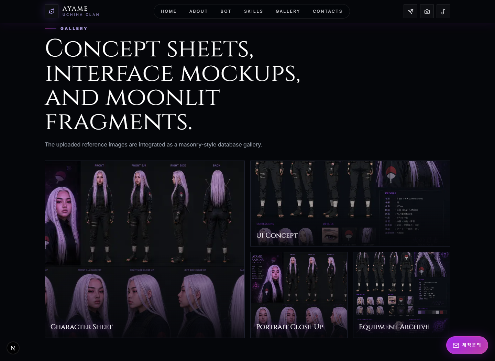
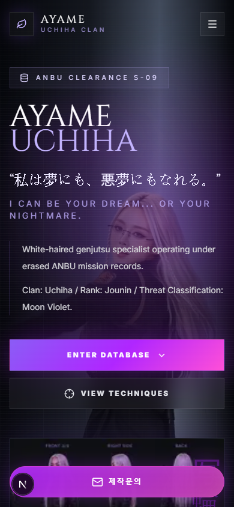

# DARIMA // AYAME UCHIHA CLAN

> 시네마틱 인터랙티브 브랜드 경험형 랜딩페이지, 게임 캐릭터 데이터베이스, AI 페르소나 질답, 홈페이지 제작문의 전환 흐름을 하나로 합친 프리미엄 모션 홈페이지 쇼케이스입니다.

`DARIMA // AYAME UCHIHA CLAN`은 일반형 회사 홈페이지가 아니라, 방문자가 S급 시노비 기밀 데이터베이스를 열람하는 듯한 경험을 주는 Next.js 기반 프리미엄 모션 랜딩페이지입니다. 이 프로젝트의 목적은 “홈페이지 제작 역량”을 말로 설명하는 대신, 실제 결과물 자체가 포트폴리오이자 영업 자료가 되도록 만드는 것입니다.

굳이 한 단어로 정의하면, 이 프로젝트는 `시네마틱 인터랙티브 랜딩페이지` 혹은 `고급 모션 홈페이지`에 가깝습니다. 영상, 사운드, AI 응답, 보안 문의 폼, SEO 구조가 하나의 브랜드 경험으로 묶여 있어 단순 소개 페이지보다 “한번 체험해보고 기억하게 만드는” 쪽에 초점을 둡니다.

이 README는 프로젝트 소개서이면서 사업 제안서에 가깝게 구성되어 있습니다. UX/UI 컨셉, 비즈니스 목적, 핵심 기능, AI 봇 구조, 문의 전환 설계, 보안, SEO, 배포 운영까지 한 번에 파악할 수 있도록 정리했습니다.

## 핵심 링크

| 항목 | 링크 |
| --- | --- |
| 프로덕션 도메인 | [https://www.darima.xyz](https://www.darima.xyz) |
| LUDGI 공식 정보 | [https://info.ludgi.ai](https://info.ludgi.ai) |
| 홈페이지 제작문의 수신 | `milli@molluhub.com` |

## 화면 미리보기

아래 이미지는 로컬 실행 환경에서 직접 캡처한 화면입니다. README만 열어도 프로젝트의 분위기, 섹션 흐름, 모바일 대응 상태를 빠르게 확인할 수 있도록 넣었습니다.

| 데스크톱 히어로 | 스킬 로드아웃 |
| --- | --- |
|  |  |

| AI 페르소나 Q&A | 갤러리 |
| --- | --- |
|  |  |

| 모바일 히어로 | 모바일 스킬 씬 |
| --- | --- |
|  |  |

## Executive Summary

대부분의 홈페이지는 서비스를 설명합니다. DARIMA는 “어떤 수준의 홈페이지와 랜딩페이지를 만들 수 있는지”를 체험으로 증명합니다.

DARIMA는 럿지, 주식회사 럿지, LUDGI Inc.가 만들 수 있는 홈페이지와 랜딩페이지의 방향성을 한 화면 안에서 보여주는 쇼케이스입니다. 방문자는 페이지를 스크롤하면서 다음 역량을 자연스럽게 확인합니다.

- 시네마틱 비디오 중심의 첫인상 설계
- 다크 네온 기반의 고급 UX/UI 디자인
- 게임 캐릭터 도감 같은 정보 구조
- 모바일 전용 영상 대응
- AI 페르소나 기반 질답 경험
- Cloudflare Turnstile을 통한 문의 보안
- Cloudflare Turnstile과 Upstash Redis 기반 요청 방어
- SMTP 발송 실패 시 AWS SES API fallback이 붙은 문의 메일 발송
- SEO, sitemap, RSS, robots, Open Graph 대응
- Vercel 배포에 적합한 Next.js App Router 구조

즉, 이 페이지는 “홈페이지 제작 문의를 받기 위한 홈페이지”이면서 동시에 “이 정도까지 만들 수 있다”는 실행 증거입니다.

## 사업 목적

### 해결하려는 문제

많은 기업 홈페이지와 랜딩페이지는 서로 비슷합니다. 같은 카드 레이아웃, 비슷한 문구, 무난한 CTA, 템플릿처럼 보이는 UI가 반복됩니다. 특히 AI, SaaS, 크리에이티브, 엔터테인먼트, 게임, 브랜드 경험을 다루는 회사가 이런 페이지를 사용하면 기술력과 감각이 충분히 전달되지 않습니다.

### 이 프로젝트의 기회

강한 첫인상은 문의 전환의 시작점입니다. 방문자가 페이지에 들어오자마자 “이 팀은 비주얼, 인터랙션, AI, 보안, 배포까지 실제로 구현할 수 있구나”라고 느끼면 신뢰 형성이 빨라집니다.

DARIMA는 다음 고객군을 설득하기 위한 데모로 사용할 수 있습니다.

- 투자자와 고객에게 강한 인상을 줘야 하는 스타트업
- AI 제품을 더 매력적으로 보여주고 싶은 SaaS 팀
- 캐릭터, 게임, 엔터테인먼트, 크리에이터 브랜드
- 기존 홈페이지가 평범해서 리뉴얼이 필요한 기업
- 템플릿이 아니라 맞춤형 고급 랜딩페이지가 필요한 고객
- 공공, B2B, 기술 회사 중 신뢰감과 현대적인 감각을 함께 보여줘야 하는 조직

## 브랜드 포지셔닝

이 프로젝트가 보여주는 LUDGI의 포지션은 다음과 같습니다.

| 영역 | 메시지 |
| --- | --- |
| Premium Motion Homepage | 일반 기업 소개 페이지가 아니라 영상, 사운드, 모션, AI 응답이 결합된 브랜드 경험형 홈페이지 |
| Landing Page | 짧은 시간 안에 브랜드 인상을 각인시키는 시네마틱 구성 |
| AI Experience | 정적인 FAQ가 아니라 페르소나가 있는 상호작용형 질답 |
| Digital Art UX/UI | 이미지, 영상, 글로우, 패럴랙스, 모션을 결합한 몰입형 디자인 |
| Conversion Flow | 우측 하단 플로팅 문의, Turnstile 검증, 이메일 라우팅 |
| SEO Ready | 검색 노출을 위한 메타데이터, sitemap, RSS, robots 구성 |

## UX/UI Concept

핵심 UX 컨셉은 다음 한 문장으로 정의됩니다.

> 사용자가 한 명의 위험한 S급 시노비 데이터를 열람하는 느낌.

이 페이지는 일반형 기업 랜딩페이지처럼 서비스 장점만 나열하지 않습니다. 사용자는 스크롤을 내리며 캐릭터의 프로필, 스킬, 장비, 관계, 기록, 철학, 갤러리, AI 응답을 순서대로 발견합니다.

### 감정 키워드

- mysterious
- elegant
- dangerous
- futuristic
- anime cinematic
- dark fantasy
- cyber shinobi
- tactical intelligence

### 디자인 언어

| 요소 | 방향 |
| --- | --- |
| 배경 | 거의 검정에 가까운 딥 블랙 |
| 포인트 컬러 | 네온 퍼플, 글로우 핑크 |
| 타이포그래피 | 고전적이고 위험한 세리프 타이틀, 선명한 본문 |
| 레이아웃 | Apple 스타일의 여백과 몰입형 섹션 전환 |
| 인터랙션 | 부드러운 리빌, 제한된 마그네틱 움직임, 영상 기반 깊이감 |
| 분위기 | 비밀 문서, 전술 데이터베이스, 게임 UI |

## 사용자 여정

1. 방문자는 인트로 로더를 통해 데이터베이스에 접속하는 느낌을 받습니다.
2. 히어로 섹션에서 캐릭터, 배경 영상, 글로우, CTA를 통해 첫인상을 받습니다.
3. 프로필과 스탯에서 세계관 정보를 빠르게 이해합니다.
4. 스킬 섹션에서 “여우 잔영” 액티브 스킬을 직접 눌러 영상 연출을 체험합니다.
5. AI 페르소나 Q&A에서 캐릭터가 직접 대답하는 듯한 질답을 경험합니다.
6. 장비, 능력치, 관계, 타임라인, 갤러리를 통해 정보가 확장됩니다.
7. 마지막 CTA와 우측 하단 플로팅 문의 버튼을 통해 제작문의로 연결됩니다.

## 주요 기능

### 1. Intro Loader

사이트 진입 시 `ACCESSING SHINOBI DATABASE...` 콘셉트의 로딩 화면을 보여줍니다. 검은 배경, 보라색 로딩 링, 글리치 텍스트를 통해 일반 웹사이트가 아니라 기밀 데이터베이스를 여는 듯한 분위기를 만듭니다.

### 2. Sticky Navbar

상단 내비게이션은 투명한 백드롭 블러 기반으로 동작합니다. 스크롤 시 배경 농도와 블러가 증가하며, 사이트의 다크 시네마틱 톤을 해치지 않도록 얇은 보더와 글로우만 사용합니다.

### 3. Hero Section

히어로는 페이지의 가장 중요한 첫 화면입니다.

- 데스크톱과 모바일에서 서로 다른 영상 소스 사용
- 영상 종료 후 역재생 영상으로 자연스럽게 왕복 루프
- 히어로 사운드 토글 제공
- 캐릭터 이미지, 달빛, 보라색 파티클, 안개, 문양 레이어 구성
- 제한된 마그네틱 커서 반응으로 화면이 살짝 따라오는 듯한 깊이감
- `ENTER DATABASE`, `VIEW TECHNIQUES` CTA 제공

히어로의 목적은 “이 페이지는 평범하지 않다”는 인상을 첫 3초 안에 전달하는 것입니다.

### 4. Character Overview

캐릭터의 핵심 프로필을 요약합니다.

- Age
- Rank
- Clan
- Chakra Type
- Specialty
- Affiliation

UI는 글래스모피즘 카드와 퍼플 글로우 보더를 사용해 캐릭터 데이터베이스 느낌을 강화합니다.

### 5. Skill Loadout

스킬 섹션은 “금지된 기술 문서” 컨셉입니다.

현재 활성화된 대표 스킬은 `여우 잔영`입니다. 이 버튼은 일반 버튼이 아니라 게임 스킬 슬롯처럼 보이도록 설계되어, 사용자가 눌러보고 싶게 만드는 것을 목표로 합니다.

동작 방식은 다음과 같습니다.

1. 기본 상태에서는 `skill-waiting.mp4`가 배경에서 은은하게 루프됩니다.
2. 사용자가 `여우 잔영`을 클릭하면 기존 UI가 부드럽게 바깥으로 밀려납니다.
3. 데스크톱에서는 `skill-action.mp4`, 모바일에서는 `skill-action-mobile.mp4`가 재생됩니다.
4. 스킬 영상 재생 중에는 히어로 사운드가 꺼지고, 스킬 영상 사운드가 우선됩니다.
5. 영상이 끝나면 UI가 다시 안쪽으로 모이며 기본 스킬 화면으로 복귀합니다.
6. 나머지 스킬은 레벨업 또는 잠금 상태처럼 표시되어 게임 UX 분위기를 만듭니다.

### 6. Persona Q&A Board

스킬 섹션 바로 아래에는 AI 페르소나 질답 섹션이 있습니다. 방문자는 일상적인 질문, 분위기 질문, 취향 질문, 랜덤 주제를 던질 수 있고, 서버는 `persona.md`에 정의된 캐릭터 톤을 기반으로 답변합니다.

UI는 게시판처럼 무한히 늘어나지 않도록 최신 답변 기준으로 페이지네이션 처리되어 있습니다.

특징:

- 모델명은 화면에 노출하지 않음
- 최신 답변 3개 기준으로 페이지 구성
- 랜덤 질문 생성
- 방문자 질문 등록
- 캐릭터 페르소나에 맞는 짧고 분위기 있는 답변
- 서버에서 페르소나 프롬프트를 관리해 클라이언트에 원문 노출 최소화

내부적으로 사용하는 모델은 아래와 같이 고정되어 있습니다.

```text
gpt-5.4-mini-2026-03-17
```

화면에는 모델명을 드러내지 않아 “봇”이나 “모델 데모” 느낌보다 캐릭터와 대화하는 느낌을 우선합니다.

### 7. Equipment / Statistics / Relationship / Timeline

중반 이후 섹션들은 게임 캐릭터 도감 구조를 강화합니다.

- 장비: ANBU Mask, Kunai, Scroll, Smoke Bomb, Chakra Seal
- 스탯: Speed, Strategy, Genjutsu, Taijutsu, Chakra, Intelligence
- 관계: Mentor, Rival, Clan, Allies
- 타임라인: first mission, ANBU recruitment, clan incident, forbidden technique awakening

각 섹션은 카드형 정보 구조를 사용하지만, 일반 SaaS 카드처럼 보이지 않도록 다크 판넬, 네온 보더, 모션 리빌, 데이터베이스 감성을 우선합니다.

### 8. Gallery

Pinterest 스타일의 masonry grid를 사용해 시네마틱 렌더, 클로즈업, 장면 컷, 문라이트 분위기의 비주얼을 보여줍니다. 클릭 시 몰입형 모달로 확장할 수 있는 구조를 고려한 갤러리 섹션입니다.

### 9. Philosophy / Final CTA

대형 문구와 글로우 배경으로 감정적 클라이맥스를 만듭니다.

```text
I can be your dream...
or your nightmare.
```

마지막에는 `ACCESS COMPLETE.` 메시지와 SNS, 문의 동선을 배치해 세계관 경험이 실제 전환으로 이어지도록 설계했습니다.

## 문의 전환 설계

이 프로젝트는 보기 좋은 페이지에서 끝나지 않고, 실제 홈페이지 제작문의로 이어지도록 설계되어 있습니다.

### 플로팅 문의 버튼

우측 하단에 색감이 맞는 플로팅 버튼을 배치했습니다. 사용자는 어느 섹션에 있든 빠르게 제작문의 모달을 열 수 있습니다.

### 문의 메일 라우팅

문의는 `milli@molluhub.com`으로 전송됩니다. 메일 제목과 본문에는 `darima.xyz`에서 들어온 문의라는 정보가 포함되어, 수신자가 어떤 랜딩페이지에서 발생한 문의인지 즉시 파악할 수 있습니다.

메일 제목 예시:

```text
[darima.xyz] Homepage inquiry - 고객명 / 회사명
```

메일 본문에는 다음 정보가 포함됩니다.

- 문의자 이름
- 회사명
- 이메일
- 전화번호
- 문의 내용
- 출처: `https://www.darima.xyz/`
- Turnstile 검증 여부

## 보안 설계

### Cloudflare Turnstile

문의하기 기능에는 Cloudflare Turnstile을 적용했습니다.

필요 환경 변수:

```bash
TURNSTILE_SITE_KEY=
TURNSTILE_SECRET_KEY=
```

처리 흐름:

1. 클라이언트가 `/api/turnstile/site-key`로 공개 site key를 요청합니다.
2. 문의 모달에서 Turnstile 위젯을 렌더링합니다.
3. 사용자가 검증을 통과하면 token을 받습니다.
4. `/api/inquiry`가 `TURNSTILE_SECRET_KEY`로 Cloudflare 검증을 수행합니다.
5. 검증 실패 시 메일을 전송하지 않습니다.

Turnstile 위젯은 Cloudflare iframe 내부에서 동작하므로 브라우저 콘솔에 Private Access Token, Trusted Types, preload 관련 진단 로그가 보일 수 있습니다. 실제 문의 실패 여부는 `/api/inquiry` 응답 상태와 서버 로그를 기준으로 판단합니다.

### Upstash Redis 요청 방어

Turnstile만으로는 짧은 시간에 같은 사용자가 API를 반복 호출하는 상황을 모두 막기 어렵기 때문에, 백엔드에는 Upstash Redis 기반 요청 방어가 함께 들어가 있습니다.

- `/api/inquiry`: 동일 사용자 기준 5분 cooldown, 전송 중 30초 in-flight lock
- `/api/persona-bot`: 동일 사용자 기준 2분 cooldown, 생성 중 in-flight lock
- 식별 기준: IP, user-agent, 입력 이메일 또는 클라이언트 식별자를 조합한 서버 측 identity
- 저장소 장애 시 무제한 허용하지 않고 보수적으로 503 또는 429 응답

필요 환경 변수:

```bash
KV_REST_API_URL=
KV_REST_API_TOKEN=
```

### 환경 변수 보호

이 레포지토리는 public 레포로 운영될 수 있으므로 `.env` 파일은 Git에 올라가지 않도록 관리해야 합니다. `.gitignore`에서 `.env*` 패턴을 통해 민감 정보 커밋을 방지합니다.

## 이메일 발송 구조

문의 메일은 SMTP/nodemailer를 먼저 시도하고, SMTP 인증 실패나 미설정 상태에서는 AWS SES API로 fallback되도록 구성되어 있습니다. 운영 중 `535 Authentication Credentials Invalid` 같은 SMTP 오류가 발생해도 SES API 자격 증명이 정상이라면 문의 발송이 이어집니다.

필요 환경 변수:

```bash
AWS_ACCESS_KEY_ID=
AWS_REGION=
AWS_S3_BUCKET_NAME=
AWS_SECRET_ACCESS_KEY=
AWS_SES_ACCESS=
AWS_SES_API_VERSION=
AWS_SES_EMAIL_SENDER_ADDRESS=
AWS_SES_ENDPOINT=
AWS_SES_PORT=
AWS_SES_REGION=
AWS_SES_SECRET=
```

서버 API:

```text
POST /api/inquiry
```

핵심 파일:

```text
src/app/api/inquiry/route.ts
```

## AI 페르소나 구조

AI 질답 기능은 Vercel AI SDK와 OpenAI 모델을 사용합니다.

서버 API:

```text
POST /api/persona-bot
```

핵심 파일:

```text
persona.md
src/app/api/persona-bot/route.ts
```

동작 구조:

1. 사용자가 질문을 입력하거나 랜덤 질문을 생성합니다.
2. 클라이언트가 `/api/persona-bot`에 요청합니다.
3. 서버는 `persona.md`를 읽고, 고정된 페르소나 규칙과 함께 모델에 전달합니다.
4. 모델은 질문의 주제에 직접 반응하면서도 캐릭터 톤을 유지해 답변합니다.
5. 클라이언트는 최신 답변을 게시판 UI에 추가하고 페이지네이션으로 관리합니다.

중요한 UX 원칙:

- 모델명은 사용자 화면에 노출하지 않습니다.
- “AI가 답한다”보다 “캐릭터가 응답한다”는 느낌을 우선합니다.
- 질문과 관계없는 분위기 문장만 출력하지 않도록 서버 프롬프트에서 질문 주제 반영을 강제합니다.

## SEO 전략

프로덕션 기준 도메인은 다음으로 설정되어 있습니다.

```text
https://www.darima.xyz/
```

대응 항목:

- canonical URL
- Open Graph 이미지
- Twitter 카드
- robots.txt
- sitemap.xml
- rss.xml
- JSON-LD 구조화 데이터
- LUDGI 관련 키워드
- 홈페이지 제작문의 관련 키워드

주요 키워드:

- 럿지
- 주식회사 럿지
- LUDGI
- LUDGI Inc.
- LUDGI Inc. homepage
- landingpage
- homepage
- 홈페이지 제작문의
- 랜딩페이지 제작
- 시네마틱 랜딩페이지
- AI 인터랙티브 홈페이지

Search Console 제출 기준:

```text
https://www.darima.xyz/sitemap.xml
https://www.darima.xyz/rss.xml
```

현재 sitemap은 검색엔진이 혼동하지 않도록 canonical homepage URL 중심으로 구성되어 있습니다. RSS는 별도 피드로 유지합니다.

## LUDGI 정보 반영

Footer와 구조화 데이터에는 LUDGI 공식 정보 페이지를 기반으로 한 회사 정보가 반영되어 있습니다.

| 항목 | 내용 |
| --- | --- |
| 회사명 | 주식회사 럿지 |
| 영문명 | LUDGI Inc. |
| 공식 정보 | [https://info.ludgi.ai](https://info.ludgi.ai) |
| 제작문의 | `milli@molluhub.com` |

## 기술 스택

| 영역 | 기술 |
| --- | --- |
| Framework | Next.js App Router |
| Language | TypeScript |
| Styling | TailwindCSS, CSS custom layers |
| Motion | Framer Motion, Lenis Scroll |
| Icons | Lucide Icons |
| AI | Vercel AI SDK, OpenAI |
| Email | SMTP/nodemailer primary, AWS SES API fallback |
| Security | Cloudflare Turnstile, Upstash Redis request guard |
| Deploy | Vercel |
| SEO | Next Metadata API, robots, sitemap, RSS |

## 프로젝트 구조

```text
src/app/layout.tsx                         SEO metadata, Open Graph, canonical
src/app/page.tsx                           메인 랜딩페이지 전체 UI
src/app/globals.css                        시네마틱 디자인 시스템과 반응형 스타일
src/app/api/inquiry/route.ts               Turnstile 검증, Redis 요청 방어, SMTP/SES fallback 문의 발송
src/app/api/persona-bot/route.ts           AI 페르소나 질답 API
src/app/api/turnstile/site-key/route.ts    공개 Turnstile site key 제공
src/app/sitemap.ts                         sitemap.xml 생성
src/app/robots.ts                          robots.txt 생성
src/app/rss.xml/route.ts                   RSS 피드 생성
persona.md                                 AI 페르소나 원본
public/assets/                             히어로, 스킬, 컨셉 이미지와 영상
docs/screenshots/                          README용 실제 화면 캡처
```

## 주요 에셋

| 파일 | 용도 |
| --- | --- |
| `ayame-hero.mp4` | 데스크톱 히어로 정방향 영상 |
| `ayame-hero-reverse.mp4` | 데스크톱 히어로 역방향 루프 영상 |
| `ayame-hero-mobile.mp4` | 모바일 히어로 세로 영상 |
| `ayame-hero-mobile-reverse.mp4` | 모바일 히어로 역방향 루프 영상 |
| `skill-waiting.mp4` | 스킬 섹션 기본 대기 배경 |
| `skill-action.mp4` | 데스크톱 여우 잔영 액션 영상 |
| `skill-action-mobile.mp4` | 모바일 여우 잔영 액션 영상 |
| `ayame-character-sheet.png` | 캐릭터 시트 |
| `ayame-ui-concept.png` | UX/UI 컨셉 목업 |

## 로컬 실행

```bash
npm install
npm run dev
```

기본 실행 주소:

```text
http://localhost:3000
```

빌드 검증:

```bash
npm run lint
npm run build
```

## 운영 체크리스트

배포 전 확인할 항목:

- `OPENAI_API_KEY` 설정
- `TURNSTILE_SITE_KEY` 설정
- `TURNSTILE_SECRET_KEY` 설정
- `KV_REST_API_URL`, `KV_REST_API_TOKEN` 설정
- SMTP 및 AWS SES API 관련 환경 변수 설정
- `https://www.darima.xyz/sitemap.xml` 접근 확인
- `https://www.darima.xyz/rss.xml` 접근 확인
- Google Search Console에 sitemap 제출
- 실제 문의 메일 1회 전송 테스트
- 모바일에서 히어로 영상과 스킬 액션 영상 확인
- Turnstile 실패 시 문의가 전송되지 않는지 확인

## 성과 지표로 볼 수 있는 것

이 프로젝트는 단순 포트폴리오가 아니라 문의 전환형 쇼케이스이므로 다음 지표를 볼 수 있습니다.

- 첫 화면 체류 시간
- 스킬 액션 버튼 클릭률
- AI 질답 섹션 사용률
- 플로팅 문의 버튼 클릭률
- 문의 폼 제출 전환율
- 모바일 이탈률
- Search Console 노출 및 색인 상태
- SNS 공유 시 Open Graph 클릭률

## 확장 로드맵

추가로 확장하면 좋은 방향:

- 관리자용 Q&A 모더레이션
- 방문자 질문 저장 DB 연동
- 다중 페르소나 선택 기능
- 갤러리 fullscreen modal 고도화
- 스킬 슬롯 추가 및 레벨업 시스템 강화
- 문의 유형별 이메일 템플릿 분기
- Vercel Analytics와 Speed Insights 연결
- A/B 테스트용 히어로 카피 변형
- 다국어 SEO 페이지 구성

## 결론

DARIMA는 “예쁜 웹사이트”가 아니라, 홈페이지 제작 역량을 사업적으로 보여주기 위한 몰입형 제품 데모입니다.

이 페이지는 방문자에게 다음 메시지를 전달합니다.

> 우리는 템플릿 같은 홈페이지가 아니라, 기억에 남고 문의로 이어지는 디지털 경험을 만들 수 있다.

그 메시지를 위해 캐릭터 세계관, 시네마틱 영상, 게임식 인터랙션, AI 질답, 보안 문의 폼, SEO 구조를 하나의 랜딩페이지 안에 통합했습니다.
